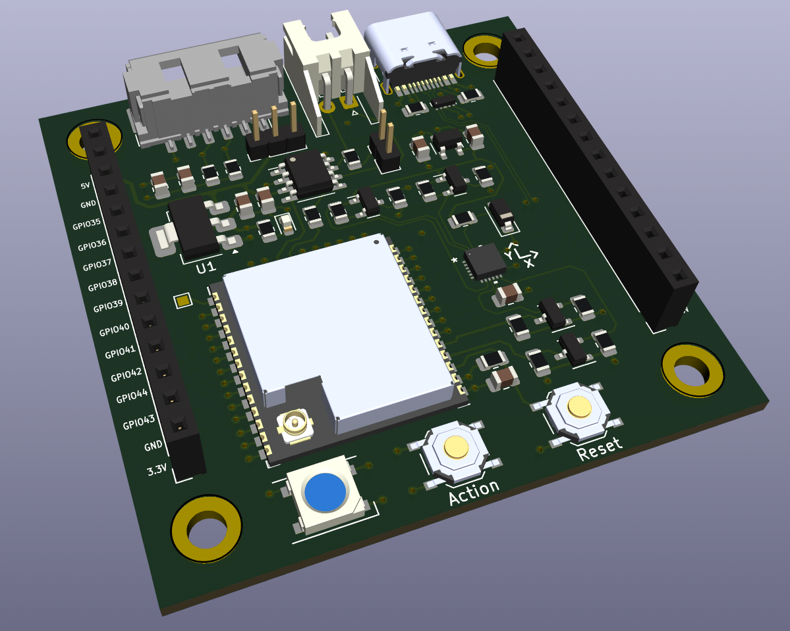
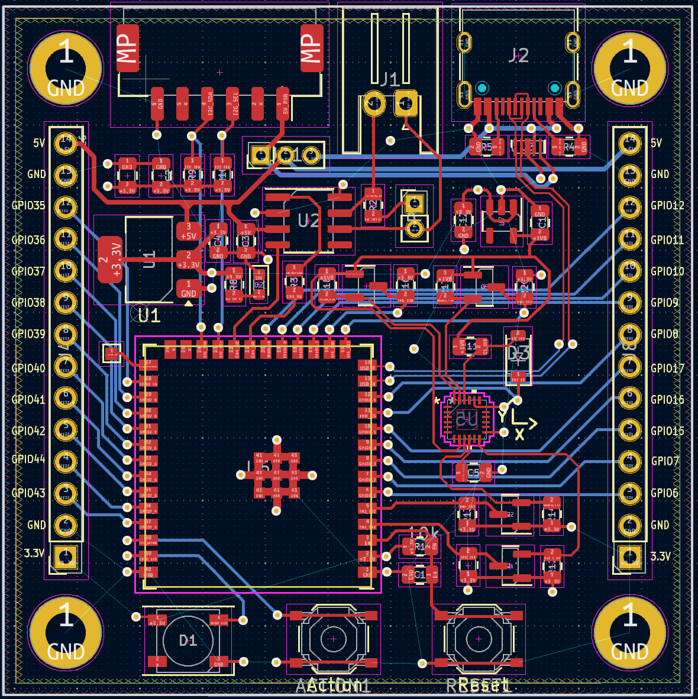

# CyberBoard - USB

This is the Kicad project for the CyberBoard. It has an ESP32S3 which is
connected via USB to a computer. The microcontroller drives the cybergear 
motors via CAN. Furthermore a MOLEX CLIK connector is integrated in order
to communicate with the power distribution board [Holybro PM03D Pixhawk 5X Power
Module](https://docs.holybro.com/power-module-and-pdb/power-module/digital-power-module-pm-setup).
This board does not only provides six XT-30 connectors for each cybergear motor,
but also an INA226 i2c power monitor unit. The IMU ICM20948 is integrated on the
CyberBoard.

